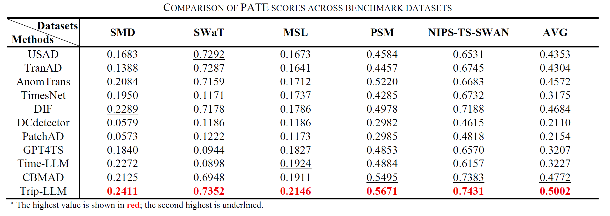

# TriP-LLM: A Tri-Branch Patch-wise Large Language Model Framework for Time-Series Anomaly Detection

This repository contains the official Python implementation of **TriP-LLM**, a novel framework for unsupervised anomaly detection in multivariate time-series data using pretrained Large Language Models (LLMs).

TriP-LLM is designed to effectively capture both local and global temporal features through a tri-branch architecture — **Patching**, **Selection**, and **Global** — enabling efficient anomaly detection with reduced memory consumption.

📄 **Paper**: [TriP-LLM: A Tri-Branch Patch-wise Large Language Model Framework for Time-Series Anomaly Detection](https://arxiv.org/abs/2508.00047)

The overall architecture of TriP-LLM is illustrated below:

<p align="center">
  
</p>


---


## 🔧 Installation

We conducted our experiments using PyTorch 2.4.1, Python 3.11 and CUDA 12.4.
```bash
pip install torch==2.4.1 torchvision==0.19.1 torchaudio==2.4.1 --index-url https://download.pytorch.org/whl/cu124
````
To install the required dependencies and set up the environment, run the following commands:

```bash
git clone https://github.com/YYZStart/TriP-LLM.git
cd TriP-LLM
pip install -r requirements.txt
````

---

## 🚀 Usage

You can reproduce our main experiments with:

```bash
python main.py
```

## Checkpoints

You can download the released checkpoints from our Hugging Face repository:  
👉 [TriP-LLM on Hugging Face](https://huggingface.co/YYZStart/TriP-LLM)

Please place the checkpoints into the `Checkpoints/TriP_LLM/` directory.

---

## 📊 Datasets

We evaluate TriP-LLM on the following benchmark time-series datasets:

* NIPS-TS-SWAN
* MSL
* SMD
* SWaT
* PSM


Put the dataset in the `Dataset/` directory.
If you would like to use other datasets, please refer to **preprocessing.py** for data formatting and processing guidelines.

---

## 📈 Results

Our method achieves state-of-the-art results across all datasets using the **PATE** evaluation metric.

<p align="center">
  
</p>

Please refer to the paper for full quantitative comparisons and detailed experimental setup.

---


## 🧩 Plug TriP-LLM into Your Own Framework

If you'd like to use **TriP-LLM** in another training or evaluation pipeline, you can easily reuse the model architecture defined in [`TriP_LLM.py`](./model/TriP_LLM.py).

The model is designed to be **framework-agnostic** — just treat it as a specialized Autoencoder:

- **Input**: multivariate time-series tensor `[B, L, M]`
- **Output**: reconstructed time-series

You can integrate TriP-LLM into your own training loop, datasets, or evaluation logic as needed.
All other components (training, evaluation, preprocessing) are modular and can be replaced.

---


## 📎 Citation

If you find this repository useful for your research, please cite our paper:

```bibtex
@misc{TriPLLM,
      title={TriP-LLM: A Tri-Branch Patch-wise Large Language Model Framework for Time-Series Anomaly Detection}, 
      author={Yuan-Cheng Yu and Yen-Chieh Ouyang and Chun-An Lin},
      journal={IEEE Access},
      year={2025},
      pages={168643-168653}
}
```


## 🙏 Acknowledgement

The detection framework and benchmark datasets of this project is built upon by the following repositories:

https://github.com/xuhongzuo/DeepOD

https://github.com/DAMO-DI-ML/KDD2023-DCdetector.git

We sincerely thank the authors of these works for open-sourcing their code and datasets.

